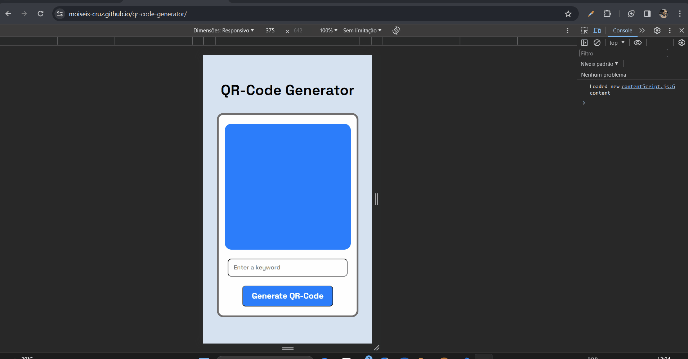

# qr-code-generator

Um pequeno projeto para manter as minhas habilidades com o consumo de <i>API</i> em prática.

Este projeto tranforma o que se foi digitado no de texto em um QR-Code, como por exemplo um e-mail. Para isso é só digitar algo no campo de texto, e clicar no botão ou teclar "enter". 

Criei dois eventos para isso. Um de "click" e outro de "keyup". No primeiro evento como o próprio nome sugere, o QR-Code é gerado ao clicar-se no botão. No segundo evento o QR-Code é criado a teclar "enter".

## Tecnologias Utilizadas:

- HTML;
- CSS;
- JavaScript (JS);
- API;

 

